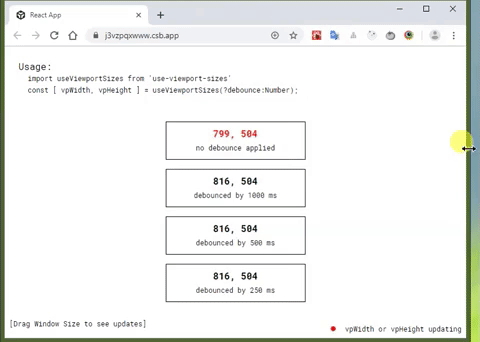

# use-viewport-sizes #

[](https://www.npmjs.com/package/use-viewport-sizes) []() [](https://github.com/rob2d/use-viewport-sizes/issues) [](https://github.com/rob2d/use-viewport-sizes/blob/master/LICENSE)

a tiny TS-compatible React hook which allows you to track visible window viewport size in your components w/ an optional debounce and other flexible options for optimal usage.

## Installation ##

```
npm install -D use-viewport-sizes
```

## Benefits ##
- extremely lightweight and zero dependencies -- adds **2kb** after gzip.
- only one `window.onresize` handler used to subscribe to any changes in an unlimited number of components no matter the use-cases.
- optional debounce to delay updates until user stops dragging their window for a moment; this can make expensive components with size-dependent calculations run much faster and your app feel smoother.
- debouncing does not create new handlers or waste re-renders in your component; the results are also pooled from only one resize result.
- optional hash function to update component subtree only at points you would like to.
- supports lazy loaded components and SSR out of the box.


## Usage ##

### **See it in Action** ###

<center>


[CodeSandbox IDE](https://codesandbox.io/s/react-hooks-viewport-sizes-demo-forked-i8urr)

</center>

### **Basic Use-case**
*registers dimension changes on every resize event immediately*

```js
import useViewportSizes from 'use-viewport-sizes'

function MyComponent(props) {
    const [vpWidth, vpHeight] = useViewportSizes();

    // ...renderLogic
}
```

### **Measure/Update only on one dimension**

If passed `options.dimension` as `w` or `h`, only the viewport width or height will be
measured and observed for updates.
The only dimension returned in the return array value will be the width or height, according
to what was passed.

```js
import useViewportSizes from 'use-viewport-sizes';

function MyComponent(props) {
    const [vpHeight] = useViewportSizes({ dimension: 'h' });

    // ...renderLogic
}
```

### **With Throttling**

If passed `options.throttleTimeout`, or options are entered as a `Number`, dimension changes
are registered on a throttled basis e.g. with a maximum frequency.

This is useful for listening to expensive components such as data grids which may be too
expensive to re-render during window resize dragging.

```js
import useViewportSizes from 'use-viewport-sizes';

function MyExpensivelyRenderedComponent(props) {
    const [vpWidth, vpHeight] = useViewportSizes({ throttleTimeout: 1000 }); // 1s throttle

    // ...renderLogic
}
```

### **With Debouncing**

If passed `options.debounceTimeout`, dimension changes are registered only when a user stops dragging/resizing the window for a specified number of miliseconds. This is an alternative behavior to `throttleTimeout` where it may be less
important to update viewport the entire way that a user is resizing.

```js
import useViewportSizes from 'use-viewport-sizes';

function MyExpensivelyRenderedComponent(props) {
    const [vpWidth, vpHeight] = useViewportSizes({ debounceTimeout: 1000 }); // 1s debounce

    // ...renderLogic
}
```

### **Only update vpW/vpH passed on specific conditions**
If passed an `options.hasher` function, this will be used to calculate a hash that only updates the viewport when the calculation changes. In the example here, we are using it to detect when we have a breakpoint change which may change how a component is rendered if this is not fully possible or inconvenient via CSS `@media` queries. The hash will also be available as the 3rd value returned from the hook for convenience.

```js
import useViewportSizes from 'use-viewport-sizes';

function getBreakpointHash({ vpW, vpH }) {
    if(vpW < 640) {
        return 'md';
    }
    if(vpW < 320) {
        return 'sm';
    }
    else if(vpW < 240) {
        return 'xs';
    }
    else {
        return 'lg';
    }
}

function MyBreakpointBehaviorComponent() {
    const [vpW, vpH, bp] = useViewportSizes({ hasher: getBreakpointHash });

    // do-something-with-breakpoints in render
    // and add new update for vpW, vpH in this component's
    // subtree only when a named breakpoint changes
}
```

## Support
If you find any issues or would like to request something changed, please feel free to [post an issue on Github](https://github.com/rob2d/use-viewport-sizes/issues/new).

Otherwise, if this was useful and you'd like to show your support, no donations necessary, but please consider [checking out the repo](https://github.com/rob2d/use-viewport-sizes) and giving it a star (⭐).

## License ##

- Open Source **[MIT license](http://opensource.org/licenses/mit-license.php)**
